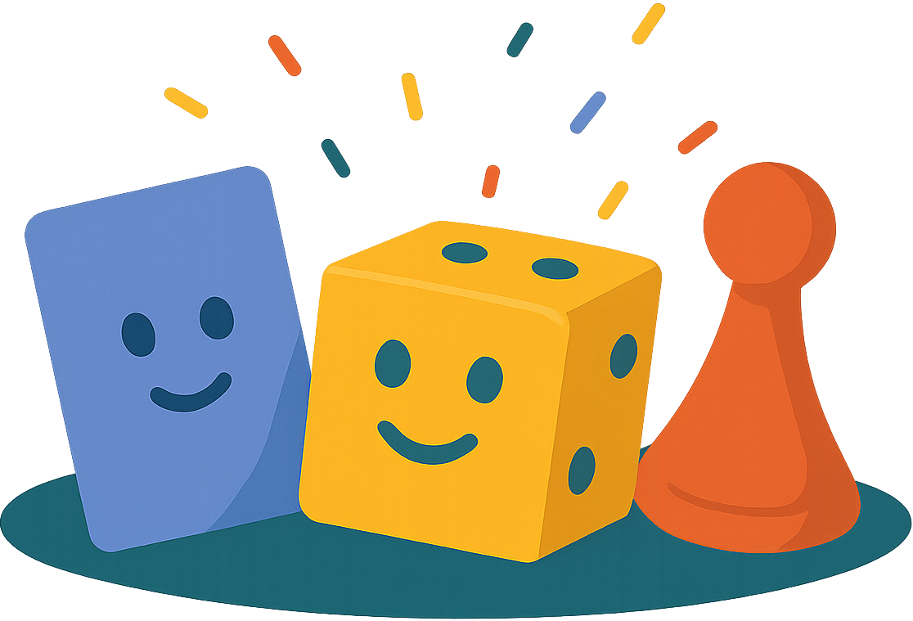

# Jumble

  

Live Site: [Jumble](https://jumble-game.vercel.app)

## Table of Contents

- [Overview](#overview)
- [Technologies](#technologies)
- [Libraries & Methodologies](#libraries--methodologies)
- [Features](#features)
- [TODOS/Features to Implement](#todosfeatures-to-implement)
- [Author Info](#author-info)

## Overview

Welcome to **Jumble**, a real-time multiplayer party game web app inspired by Jackbox and GamePigeon. Players can create rooms with unique codes and invite friends (up to 8 players) to play casual games together. There is a leaderboard functionality where users can track their wins and other stats against all active players. We are looking to add more games in the future so stay tuned!

The first game, **Word Hunter**, has players try and form the most words possible on the grid within a time limit.

  

The second game, **Timebomb**, is currently in the works. Be on the lookout for it!

  

## Technologies

- **Backend:** Node.js, Express.js
- **Frontend:** React, TypeScript
- **Database:** PostgreSQL (AWS RDS), Redis (ElastiCache)
- **Authentication:** Auth0
- **Real-time:** Socket.io
- **Styling:** Tailwind CSS
- **Deployment:** AWS EC2, Vercel

## Libraries & Methodologies

- **Real-time Communication:** Socket.io for live multiplayer gameplay
- **Authentication:** Auth0 for secure user management
- **Database Management:** Knex.js for PostgreSQL migrations and queries
- **Caching:** Redis for game state and lobby management
- **UI Components:** Radix UI primitives with custom styling
- **State Management:** React Context for user and game state

## Features

- **Word Hunter Game**: Find words on a 5x5 letter grid in real-time
- **Multiplayer Support**: Up to 8 players per room with room codes
- **Leaderboard System**: Track wins, games played, and other game statistics
- **Responsive Design**: Works on desktop and mobile devices
- **Real-time Updates**: Live score updates and game state synchronization
- **Customizable Profiles**: Edit your profile with different icons, and nicknames!

## TODOS/Features to Implement

- [ ] Add more games (Time Bomb, etc.)
- [ ] Add Google Analytics for user insights
- [ ] Implement CI/CD pipeline
- [ ] Implement AI opponents for single-player mode
- [ ] Add sound effects and audio feedback
- [ ] Optimize letter frequency distribution
- [ ] Create mobile app version

## Author Info

Created by:  
**Azim Rahat** - [Portfolio](https://azimrahat.com) | [LinkedIn](https://linkedin.com/in/azim-rahat)  
**Muntaqa Maahi** - [Portfolio](https://muntaqamaahi.com) | [LinkedIn](https://linkedin.com/in/muntaqa-maahi)

[Back to Top](#jumble-)
